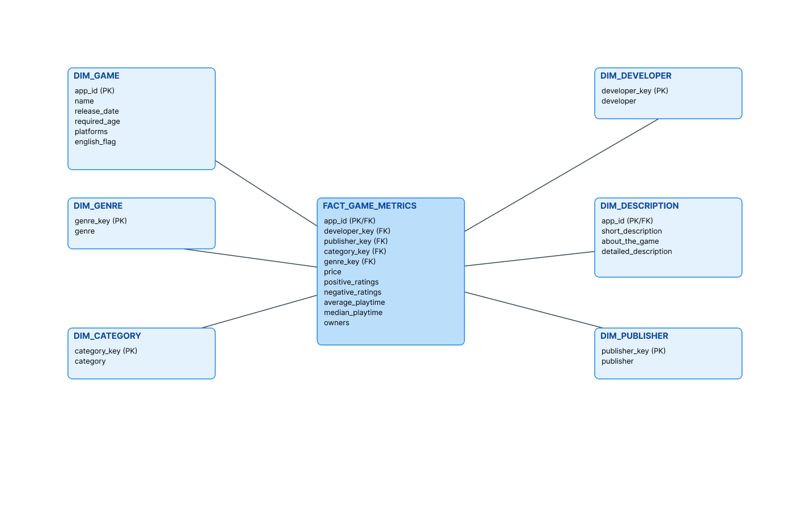

# ARCHITECTURE.md

## Architecture Overview

This project follows a **Snowflake-native medallion architecture**, separating ingestion, transformation, modeling, and enrichment into clearly defined layers. Each layer is implemented as a dedicated SQL notebook to improve clarity, maintainability, and execution flow.

---

## Data Flow

```
Raw Steam Data
      ↓
Bronze Layer (Raw Tables)
      ↓
Silver Layer (Cleaned & Normalized Tables)
      ↓
Gold Layer (Fact & Dimension Tables)
      ↓
Incremental Updates (Streams + MERGE)
      ↓
AI Enrichment (Snowflake Cortex)
      ↓
Dashboards / Analytics
```

---

## Layer Responsibilities

### Bronze

* Raw ingestion
* Minimal transformation
* Source-of-truth storage

### Silver

* Data quality enforcement
* Normalization
* Relationship modeling

### Gold

* Business metrics
* Aggregations
* Star schema

### Incremental Layer

* Change tracking
* Efficient refreshes
* Production-style updates

### AI Enrichment

* Sentiment analysis
* Text summarization
* Semantic features

---

## Star Schema Design



The warehouse follows a star schema with fact tables capturing measurable events
(e.g., reviews, playtime, pricing) and dimension tables describing entities such
as games, publishers, genres, and categories. Bridge tables are used to model
many-to-many relationships.

* **Fact tables** capture measurable events (e.g., reviews, playtime)
* **Dimension tables** describe entities (games, publishers, categories)
* **Bridge tables** handle many-to-many relationships

---

## Why This Architecture

* Scales cleanly with new data sources
* Supports analytics, ML, and BI workloads
* Mirrors Snowflake best practices used in industry

---

## Summary

This architecture prioritizes clarity, scalability, and analytical correctness. By leveraging Snowflake-native notebooks, streams, and AI services, the pipeline demonstrates how modern analytics platforms unify data engineering, analytics, and machine learning in a single environment.

